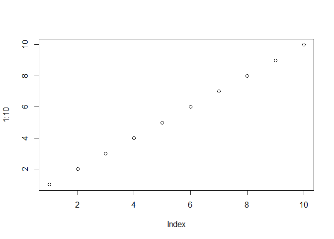
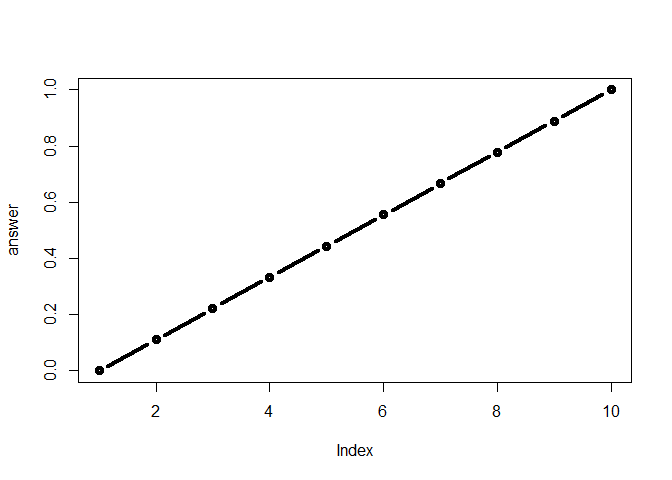

# This is Header 1

This is my work from Class 06 in **BIMM 143**.

## This is Header 2.

This is a story of a girl. Who cried a river and **drowned** the whole world.

### This is Header 3.
The more hashtag signs put in front, the smaller the font is.


```r
#This demos a code code through the use of the "Insert" function in RStudio
plot(1:10)
```

<!-- -->


## Practice reading files (once again)


```r
## There several types of functions that can read certain types of files in consideration to how the data values within are separated. 

#read.delim(“filename.txt”, sep="\t") TAB
#read.csv(“filename.txt”, sep=",") COMMA
#read.csv2(“filename.txt”, sep=";") SEMI-COLON
#read.table(“filename.txt”, sep="") WHITE SPACE 

read.csv("test1.txt")
```

```
##   Col1 Col2 Col3
## 1    1    2    3
## 2    4    5    6
## 3    7    8    9
## 4    a    b    c
```

```r
read.table("test2.txt", sep = "$", header=TRUE)
```

```
##   Col1 Col2 Col3
## 1    1    2    3
## 2    4    5    6
## 3    7    8    9
## 4    a    b    c
```

```r
read.table("test3.txt", sep="")
```

```
##   V1 V2 V3
## 1  1  6  a
## 2  2  7  b
## 3  3  8  c
## 4  4  9  d
## 5  5 10  e
```

```r
# It's important to understand if your file already has pre-existing headers. If so, including the "header=" parameter is necessary.
# There are even more specific file reading functions, but these are relevant one
```


## Creating Functions


```r
add <- function(x, y=1) {
 # Sum the input x and y
 x + y
}

add(1)
```

```
## [1] 2
```

```r
#The following overrides the y-value input in our initial function. 
add(5,5)
```

```
## [1] 10
```

```r
#The addition of a z-value yeilds an error because of the fact that it cannot utilize it in the function. This goes for adding integers to characters strings.

# Adding c bindings will add the y-value to all of the x-bounded values.

add( c(1, 2, 3) )
```

```
## [1] 2 3 4
```

```r
# The following function overries the y-value again to add to the x-bounded values. 

add( c(1, 2, 3), 4 )
```

```
## [1] 5 6 7
```

#### Creating a Function from scratch


```r
rescale <- function(x) {
 rng <-range(x)
 (x - rng[1]) / (rng[2] - rng[1])
}

# Using the range() function allows you to pick out the min and max values. range(1) allows you to pick out the minimum value, whereas range(2) allows you to pick out the maximum value. 

rescale(1:10)
```

```
##  [1] 0.0000000 0.1111111 0.2222222 0.3333333 0.4444444 0.5555556 0.6666667
##  [8] 0.7777778 0.8888889 1.0000000
```


```r
# How to deal with character strings within a code(ie. rescale( c(1,2,NA,3,10) )
# Troubleshooting is an important skill

rescale2 <- function(x) {
 rng <-range(x)
 (x - rng[1]) / (rng[2] - rng[1])
}

x <- rescale2( c(1,2,NA,3,10) )
rng <- range(x)
rng
```

```
## [1] NA NA
```


```r
# Fortunately, there are NA specific parameters that omit the NA values
rescale2 <- function(x) {
  rng <- range (x, na.rm = TRUE)
  (x-rng[1])/(rng[2]-rng[1])
}

rescale2(c(1,2,NA,3,10))
```

```
## [1] 0.0000000 0.1111111        NA 0.2222222 1.0000000
```

## Barry's cool code


```r
rescale3 <- function(x, na.rm=TRUE, plot=FALSE) {
 rng <-range(x, na.rm=na.rm)
 print("Hello")
 answer <- (x - rng[1]) / (rng[2] - rng[1])
 print("is it me you are looking for?")
 if(plot) {
 plot(answer, typ="b", lwd=4)
 }
 print("I can see it in ...")
 return(answer)
 
 #It's important to have return(answer) at the end in order to prevent pre-mature ending as it ceases the reading of code where it is.
 
}

rescale3(1:10)
```

```
## [1] "Hello"
## [1] "is it me you are looking for?"
## [1] "I can see it in ..."
```

```
##  [1] 0.0000000 0.1111111 0.2222222 0.3333333 0.4444444 0.5555556 0.6666667
##  [8] 0.7777778 0.8888889 1.0000000
```

```r
rescale3(1:10, plot=TRUE)
```

```
## [1] "Hello"
## [1] "is it me you are looking for?"
```

<!-- -->

```
## [1] "I can see it in ..."
```

```
##  [1] 0.0000000 0.1111111 0.2222222 0.3333333 0.4444444 0.5555556 0.6666667
##  [8] 0.7777778 0.8888889 1.0000000
```

# How do we improve this chunk of code?

library(bio3d)
s1 <- read.pdb("4AKE") # kinase with drug
s2 <- read.pdb("1AKE") # kinase no drug
s3 <- read.pdb("1E4Y") # kinase with drug
s1.chainA <- trim.pdb(s1, chain="A", elety="CA")
s2.chainA <- trim.pdb(s2, chain="A", elety="CA")
s3.chainA <- trim.pdb(s1, chain="A", elety="CA")
s1.b <- s1.chainA$atom$b
s2.b <- s2.chainA$atom$b
s3.b <- s3.chainA$atom$b
plotb3(s1.b, sse=s1.chainA, typ="l", ylab="Bfactor")
plotb3(s2.b, sse=s2.chainA, typ="l", ylab="Bfactor")
plotb3(s3.b, sse=s3.chainA, typ="l", ylab="Bfactor") 

## I don't know but it's time to do some code.

