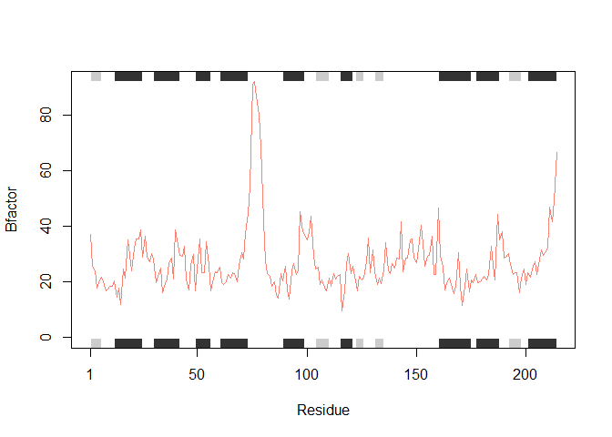
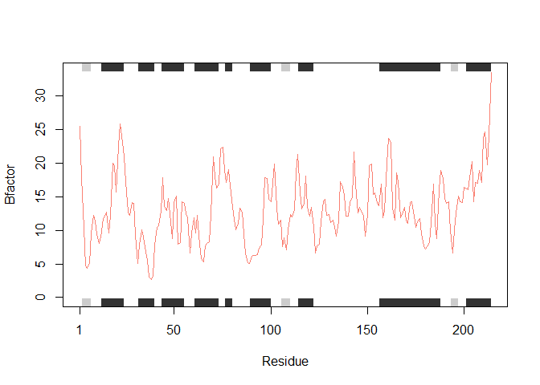

Class 06 Lab
================
Mark Allan Co Jacob
10/17/2019

## Installing the **bio3d** package for sequence and structure analysis

``` r
# install.packages("bio3d")
```

``` r
library(bio3d)

# The variables within this set are the codes we need to make a function out of (i.e. 4AKE, 1AKE, and 1E4Y)

s1 <- read.pdb("4AKE") # kinase with drug
```

    ##   Note: Accessing on-line PDB file

``` r
s2 <- read.pdb("1AKE") # kinase no drug
```

    ##   Note: Accessing on-line PDB file
    ##    PDB has ALT records, taking A only, rm.alt=TRUE

``` r
s3 <- read.pdb("1E4Y") # kinase with drug
```

    ##   Note: Accessing on-line PDB file

``` r
# It seems as though the trim.pdb command is constant as well as its parameters. s3 seems to have a copy and paste inconsistency as it references s1. We could reduce this down to a single command.

s1.chainA <- trim.pdb(s1, chain="A", elety="CA")
s2.chainA <- trim.pdb(s2, chain="A", elety="CA")
s3.chainA <- trim.pdb(s3, chain="A", elety="CA")

# The following can be reduced down to a single command it appears.

s1.b <- s1.chainA$atom$b
s2.b <- s2.chainA$atom$b
s3.b <- s3.chainA$atom$b

# We could turn these plots into a plotb3() command if answers become available.

plotb3(s1.b, sse=s1.chainA, typ="l", ylab="Bfactor")
```

<!-- -->

``` r
plotb3(s2.b, sse=s2.chainA, typ="l", ylab="Bfactor")
```

<!-- -->

``` r
plotb3(s3.b, sse=s3.chainA, typ="l", ylab="Bfactor")
```

<!-- -->

### This is the thought process of a condensed chunk of code.

``` r
# I can assign each pdb code a variable, but I can instead just rely on using character strings within my custom function to create these graphs.


# This line assigns a function to my WhackPDB command. The variable "x" can work with any PDB code - granted that it is in quotation marks. This allows us to call upon 'WhackPDB' for the mobility graphs we want via PDB code.
WhackPDB <- function(x){
  
# This line takes the variable that has been inputted into our function and searches it against the pdb database in order to spit out a coordinate file. This file is then stored into vector 'Cat'.
 Cat <- read.pdb(x)
 
 # This line - Since our pdb file named 'Cat' needs to be trimmed, we run it against the command 'trim.pdb' under parameters of 'Chain = A' and 'elety="CA"' . This yields a trimmed pdb file that is stored within my 'Lion' vector. 
 Lion <- trim.pdb(Cat, chain="A", elety="CA")
 
 # This line takes our stored trimmed vector 'Lion' and searches within that list for specifications of 'atom' and 'b' with the use of the dollar sign ($). This grabs certain elements of the list and stores it within vector 'Jaguar'.
 Jaguar <- Lion$atom$b
 
 # This line takes the elements in vector 'Jaguar' and plots against the 'plotb3' function under the parameters of 'sse' equaling the trimmed pdb list stored in vector 'Lion', a line graph, and a y-axis label called 'Bfactor'.
 plotb3(Jaguar, sse=Lion, typ="l", ylab="Bfactor", col="salmon")
}

# This is the result of inputting the specific PDB codes given. This works for any PDB code found within the library of bio3d.
WhackPDB("4AKE")
```

    ##   Note: Accessing on-line PDB file

    ## Warning in get.pdb(file, path = tempdir(), verbose = FALSE): C:
    ## \Users\oahu_\AppData\Local\Temp\RtmpAz0iTG/4AKE.pdb exists. Skipping
    ## download

<!-- -->

``` r
WhackPDB("1AKE")
```

    ##   Note: Accessing on-line PDB file

    ## Warning in get.pdb(file, path = tempdir(), verbose = FALSE): C:
    ## \Users\oahu_\AppData\Local\Temp\RtmpAz0iTG/1AKE.pdb exists. Skipping
    ## download

    ##    PDB has ALT records, taking A only, rm.alt=TRUE

<!-- -->

``` r
WhackPDB("1E4Y")
```

    ##   Note: Accessing on-line PDB file

    ## Warning in get.pdb(file, path = tempdir(), verbose = FALSE): C:
    ## \Users\oahu_\AppData\Local\Temp\RtmpAz0iTG/1E4Y.pdb exists. Skipping
    ## download

<!-- -->
